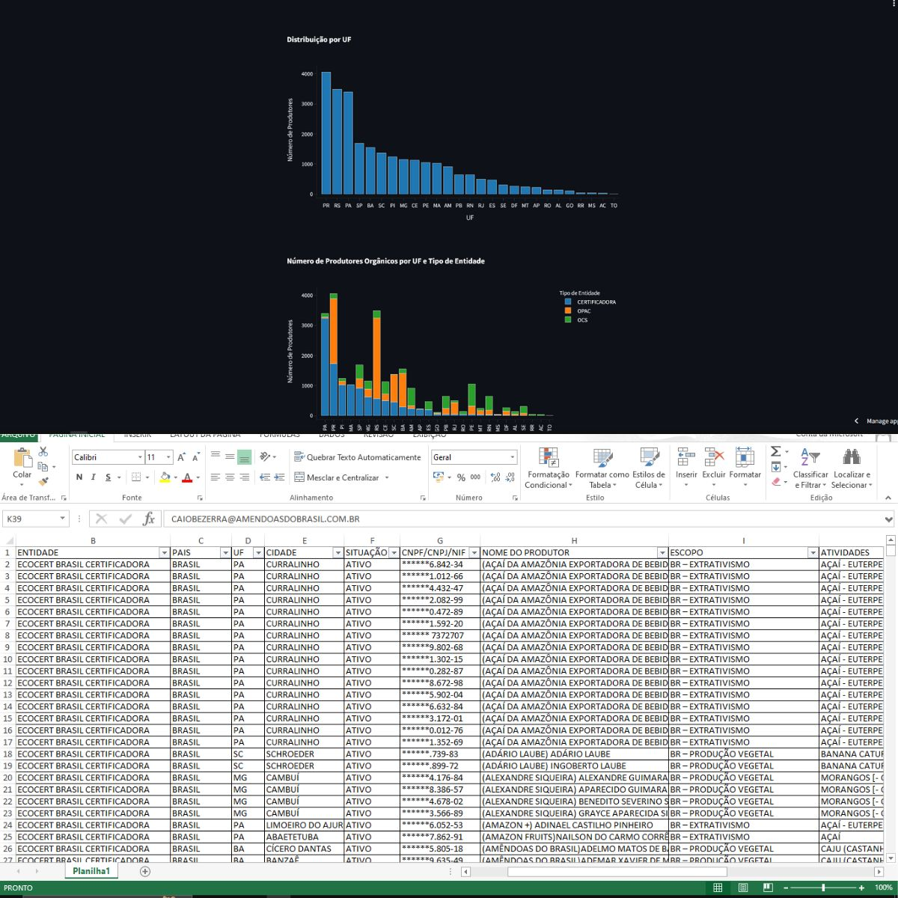

**Projeto de construção de uma visualização para o CNPO (Cadastro Nacional de Produtores Orgânicos)**

Aqui você encontra a relação de Produtores Orgânicos de todo o Brasil, a listagem dos organismos que controlam a qualidade orgânica e a listagem de organizações de controle social, que comercializam seus produtos diretamente ao consumidor.

O objetivo é disponibilizar as informações e os principais dados com uma interface de visualização.

